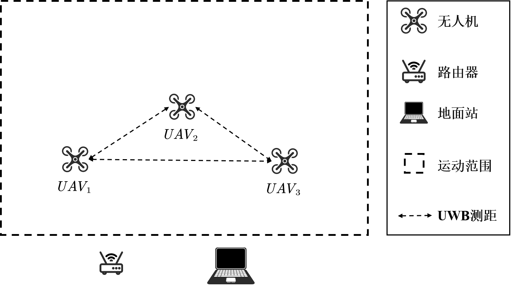

# 0 项目说明

- 利用测距信息优化无人机视觉定位的位姿，每架无人机的初始位置固定，通常根据无人机的id，1号无人机在最右边，其它无人机依次往左摆开，间隔固定，每架无人机自身运行视觉SLAM代码，发布自身的位姿，通过网络共享自身的位姿，结合测距信息，初始位置间隔以及接收到的其它无人机位姿利用ceres优化无人机位姿。
- 不同于仿真模拟数据集，实际使用过程中发现由于真实的UWB噪声较大，直接用UWB测距会导致轨迹非常波动难以保证无人机平稳飞行，通过设置UWB测距优化的权重，并设置平滑性优化项保证轨迹的平滑性
- 整体定位效果不稳定且操作复杂 :warning::warning::warning:，如果需要多机定位作为基础支撑完成其它任务，很不建议采用这种方式，仅作为项目需要。



# 1 安装配置

- 环境说明：`Ubuntu20.04`、`ROS1.0 Noetic` 

- 如果配置了新电脑，机载电脑名统一设置为coolas，密码统一为504，用户名从nuc1，nuc2逐步递增，方便一键运行脚本运行

- 安装配置

  ```shell
  # 1 编译代码
  mkdir -p ~/JWK_PROJECT/swarm_vins_ws/src
  git clone https://github.com/yonggaogit/swarm_vins.git
  cd ~/JWK_PROJECT/swarm_vins_ws/
  #一次编译可能会报错，因为其中有相互依赖的包，要保证编译后才能被其它的使用，如果catkin_make报错，输入 source devel/setup.bash 后再继续输入 catkin_make ，重复多次（3次左右）就能保证成功编译。当然因为测试的电脑都是使用过很久的，大部分依赖包都装过了，如果遇到一些其它问题在网上检索一下，通常下一些依赖包就可以了。
  catkin_make
  
  
  # 2 chmod 一键运行脚本
  cd ~/JKW_PROJECT/swarm_vins_ws/src/swarm_vins/network_utils/shfiles
  chmod +x *.sh
  cd ~/JKW_PROJECT/swarm_vins_ws/src/swarm_vins/network_utils/shfiles/tmp
  chmod +x *.sh
  
  
  # 3 增加USB端口的操作权限，避免每次都要sudu chmod +x /dev/ttyACM0
  # 注意coolas是登录的用户名，如果都按照环境配置说明了就没问题，如果不是按照实际情况修改。
  sudo usermod -aG dialout coolas
  
  # 4：注！！！：本项目还需要基于Fast-Drone-250完成无人机的飞行控制，如果没有下载Fast-Drone-250请下载，务必下载到~/JWK_PROJECT/目录下，因为有些一键启动脚本是按照这样的路径设置的
  cd ~/JWK_PROJECT/
  git clone https://github.com/ZJU-FAST-Lab/Fast-Drone-250.git
  cd ~/JWK_PROJECT/Fast-Drone-250
  catkin_make
  # 注：可能会报错，Fast-Drone-250有很多依赖，具体需要安装的依赖请参考官方github的README.md
  # 其中的VINS参数记得自己重新标定一下，参照官方教程，还要VINS配置文件中的OUTPUT文件夹记得建好，这里的问题在官方仓库中都有了详细的说明。
  
  # 4：写入环境变量，这样就可以在任意目录下启动节点，不需要source。当然要注意不能有节点名冲突，比如你之前下载了VINS也把它写入了~/.bashrc环境变量，但是Fast-Drone-250中也有VINS节点，这样就会同名冲突，写入后检查一下有没有冲突的。此外刚写入后需要关闭当前终端重新开启后才生效，或者在当前终端中再 source ~/.bashrc 才生效。
  echo "source ~/JKW_PROJECT/swarm_vins_ws/devel/setup.bash" >> ~/.bashrc
  echo "source ~/JKW_PROJECT/Fast-Drone-250/devel/setup.bash" >> ~/.bashrc
  ```

  

# 2 模块说明

## 2.1 network_utils

- 用途：通过`ZeroMQ`将每个无人机自身由`VINS`估计的位姿话题通过`TCP`网络发送到其它无人机上，其它无人机在接收到后再通过话题的机制在本机发送出来

  - 由于无人机的初始位姿并不是相同的，而由`VINS`估计的单机位姿又是以自身运动起点为原点的位姿，因此在真实飞行时需要按照固定的间隔摆放无人机，在`network_utils/config/drone_config.cfg`文件中通过`offset_multiplier`来指明这个摆放间隔。从y轴的方向放置。接收到数据发送出来时会以自身为原点，比如我的无人机id是2，那么接收到无人机id是1时会将它的y坐标减去`offset_multiplier`，而如果是4号无人机，那么会将它的y坐标加上`2*offset_multiplier`

- 单独启动可以通过`network_utils/launch/start_drone.launch`来启动，但是更建议用`network_utils/shfiles`下的脚本来启动，具体启动方法将在下文中说明。

  - `drone{i}_ip`表示的是五架无人机的ip地址（最多支持五架，具体无人机的架数通过`num_drones`指示），`base_port`指示通信端口。`offset_multiplier`指示摆放无人机时的固定间隔。`odom_topic`指的是接收到其它无人机的里程计话题后以什么样的话题名后缀发布出来（因为是通过TCP发送里程计数据的，所以接收到后要重新组织为Odometry类型的话题并发布，通常是根据无人机id将其命名为`drone_{drone_id}/{odom_topic}`），`vins_topic`就是自身的里程计话题。

  ```launch
  <arg name="drone_id" default="1"/>
  <arg name="num_drones" default="3"/>
  <arg name="drone1_ip" default="192.168.7.104"/>
  <arg name="drone2_ip" default="192.168.7.202"/>
  <arg name="drone3_ip" default="192.168.1.3"/>
  <arg name="drone4_ip" default="192.168.1.4"/>
  <arg name="drone5_ip" default="192.168.1.5"/>
  <arg name="base_port" default="5555"/>
  <arg name="offset_multiplier" default="1.0"/>
  <arg name="odom_topic" default="/vins_fusion/imu_propagate"/>
  <arg name="vins_topic" default="/vins_fusion/imu_propagate"/>
  ```

## 2.2 ranging_fusion

- 订阅`VINS_FUSION`发布的位姿估计话题，同时接收其它无人机的位姿数据以及UWB测距数据，利用测距优化原始位姿。

- 单独启动可以通过`ranging_fusion/launch/ranging_fusion.launch`启动，但是更建议用`network_utils/shfiles`下的脚本来启动，具体启动方法将在下文中说明。

  - `drone_id`和`num_drones` 主要是为了明确需要订阅哪些其它无人机的位姿话题，比如当前的`num_drones=4`，而本机的`drone_id=2`，那么需要订阅的话题就是`/drone_1/vins_fusion/imu_propagate`，`/drone_3/vins_fusion/imu_propagate`、`/drone_4/vins_fusion/imu_propagate`。其实不一定是`vins_fusion/imu_propagate`后缀，而应该是`network_utils`里的`odom_topic`作为后缀，但这里直接假设`odom_topic`和`vins_topic`一样了，在代码中都用本模块`launch`文件中的`self_odom_topic`了。
  - `pose_graph_path_topic`、`self_odom_topic`、`linktrack_nodeframe_topic`及`imu_topic`为对应的路径、里程计、UWB测距及IMU话题，需要确保修改正确
  - `uwb_vio_config`是优化过程中需要用到的参数，通常是不用改的，参数名字都顾名思义，在`/home/coolas/JKW_PROJECT/swarm_vins_ws/src/swarm_vins/ranging_fusion/config/param.yaml`中都可以看到。

  ```launch
  <arg name="drone_id" default="1" />
  <arg name="num_drones" default="2" />
  <arg name="uwb_vio_config" default="/home/coolas/JKW_PROJECT/swarm_vins_ws/src/swarm_vins/ranging_fusion/config/param.yaml" />
  <arg name="pose_graph_path_topic" default="/pose_graph/path_1"/>
  <arg name="self_odom_topic" default="/vins_fusion/imu_propagate"/>
  <arg name="linktrack_nodeframe_topic" default="/nlink_linktrack_nodeframe2"/>
  <arg name="imu_topic" default="/mavros/imu/data_raw"/>
  ```

## 2.3 nlink_parser

- linktrack UWB的官方功能包，但进行了一定的修改，不要用官方自己的，主要修改其实就是在其自定义的msg中加入header头信息，保证能够拿到时间戳信息，还利用联合回调函数。
- 还需要注意一下就是刷UWB标签的时候要保证和无人机编号统一，但是uwb是从0开始的，无人机的`drone_id`是从1开始的，所以`uwb_id=drone_id-1`。
- 单独启动可以通过`nlink_parser/launch/linktrack.launch`启动。但是更建议用`network_utils/shfiles`下的脚本来启动，具体启动方法将在下文中说明。


# 3 使用说明

- 修改配置文件，配置文件在`~/JKW_PROJECT/swarm_vins_ws/src/swarm_vins/network_utils/config/drone_config.cfg` 下，具体内容及其解释如下：

  ```cfg
  # 指示无人机的数量
  NUM_DRONES=2
  
  # 服务器的IP
  SERVER_IP=192.168.7.105
  
  # 无人机的IP，序号要对应，有几架写几个，后面的保持默认就可以，因为会通过NUM_DRONES读具体的数量。
  DRONE1_IP=192.168.7.104
  DRONE2_IP=192.168.7.202
  DRONE3_IP=192.168.1.3
  DRONE4_IP=192.168.1.4
  DRONE5_IP=192.168.1.5
  
  # 放置无人机的偏移量，以1号无人机为起点，其它的摆在它的右边，依次间隔这个距离（用卷尺量）
  OFFSET_MULTIPLIER=1.0
  
  # 无人机机载电脑的账户名和密码，所以设置时需要保持一致
  USER=coolas
  PASSWORD=504
  
  # 会在每个无人机上录制它们的飞行时的一些可视化数据，录制的ROSBAG名称
  ROS_BAG_NAME=data.bag
  
  # 两种通信端口
  SERVER_TO_CLIENT_BASE_PORT=8888
  CLIENT_TO_SERVER_BASE_PORT=9999
  
  # 一些配置文件的位置，通常是不需要改的
  RVIZ_CONFIG=/home/coolas-fly/JKW_PROJECT/swarm_vins_ws/src/swarm_vins/network_utils/config/default.rviz
  UWB_VIO_CONFIG=/home/coolas/JKW_PROJECT/swarm_vins_ws/src/swarm_vins/ranging_fusion/config/param.yaml
  
  # 一些话题名，通常不需要修改。
  ODOM_TOPIC=/vins_fusion/imu_propagate
  VINS_TOPIC=/vins_fusion/imu_propagate
  IMU_TOPIC=/mavros/imu/data_raw
  POSE_GRAPH_PATH_TOPIC=/pose_graph/path_1
  LINKTRACK_NODEFRAME_TOPIC=/nlink_linktrack_nodeframe2
  ```

  

- 完全按照`~/JKW_PROJECT/swarm_vins_ws/src/swarm_vins/network_utils/shfiles`下的shell脚本顺序运行即可。

  ```shell
  cd ~/JKW_PROJECT/swarm_vins_ws/src/swarm_vins/network_utils/shfiles
  
  # 在shell中输入 ./1 后按tab键会自动补全，后面的同理。
  # 这个脚本的作用是启动所有无人机上的VINS代码，开启视觉定位。
  ./1_start_all_vins.sh
  
  
  # 同一目录下开启新的终端
  # 这个脚本的作用是开启rviz可视化同时开启服务端监听端口，等待接收来自无人机的数据，可视化的内容是所有无人机的vins定位结果，在开始前可以轻微移动看看它们定位漂移没有
  # 还可以可视化后面的优化后的全局path和Odometry
  # 并没有稠密建图的可视化，因为这么多无人机发现这么大的数据量会很卡，只看轨迹就可以了，具体的建图结果，在每个无人机上录制就行了。
  ./2_start_rviz.sh
  
  # 从rviz中看，如果哪架无人机定位漂移了，关闭无人机的VINS节点重新启动，重新初始化，重新测试，如果正常就不要用这个脚本，其中{drone_id}是1，2，3，4的序号
  ./stop_vins.sh {drone_id}
  
  
  
  # 同一目录下开启新的终端
  # 这个脚本的作用是所用无人机与服务器建立网络连接，同时订阅无人机上的VINS位姿话题发送到服务器端，服务器端接收到后会加上前缀发布出来，在前面的可视化程序中显示出来
  # 还有就是后面开启ranging_fusion后，也订阅它们的输出话题发送到服务器端可视化。
  ./3_start_all_drone_node.sh
  
  
  # 同一目录下开启新的终端
  # 这个脚本的作用是启动前面所说的network_utils/launch/start_drone.launch，就是无人机之间相互发送位姿数据，解码后在本机上通过话题发布出来。同时也会开启UWB测距节点。
  ./4_start_all_drones.sh
  
  
  # 同一目录下开启新的终端，这个脚本的作用就是启动ranging_fusion优化位姿
  ./5_start_all_ranging_fusion.sh
  
  # 同一目录下开启新的终端
  # 这个就是Fast-Drone-250的相关脚本了，run_control是一个转换脚本，与控制指令相关的
  ./6_start_all_run_control.sh
  
  
  # 同一目录下开启新的终端
  # 这个就是Fast-Drone-250的相关脚本了，所有无人机起飞
  ./7_all_takeoff.sh
  
  
  # 同一目录下开启新的终端
  # 开始在每个无人机上录制相关的话题数据，比如前面所说的稠密建图相关的话题数据，录制在无人机的机载电脑上，记得拷贝下来。
  ./8_start_record.sh
  
  # 同一目录下开启新的终端
  # 所有无人机开始执行ego_planner，按照固定航线飞行，需要按照flight_type=2，预定航点飞行
  ./9_start_all_ego_planner.sh
  
  # 同一目录下开启新的终端
  # 提前输好这个指令，但不运行，待任务执行完毕后执行，无人机平稳降落
  # ！！！！！！！如果中途出现控制不稳定漂移，请采取遥控器紧急断电，具体做法参考Fast-Drone-250教程，时刻握着紧急断电按钮，确保安全，一旦无人机飞行不对劲，立马全部断电，保证安全！！！。只有飞行顺利的情况下采用脚本平稳降落
  ./A_all_land.sh
  
  
  # 因为是远程启动的，按Ctrl-C是没用的，需要通过这个脚本关闭，所有都弄完后，输入这个脚本，关闭某架无人机上的所有节点
  # 其中{drone_id}是1，2，3，4的序号
  ./stop_all_nodes.sh {drone_id}
  ```